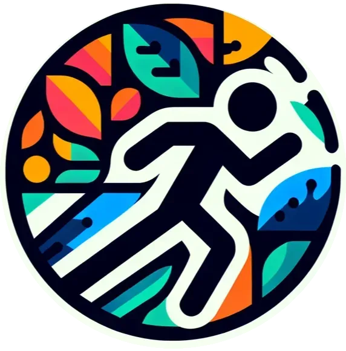
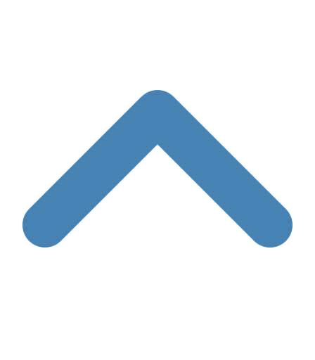

<!-- PROJECT LOGO -->
 

  

  <h3 align="center">FitnessBytes</h3>

  

    A Social Media platform designed to support your journey towards personal and professional fitness success.
     
    <a href="https://www.fitness-bytes.com/">See the site Live!</a>
  

<!-- TABLE OF CONTENTS -->

  
Table of Contents

  <ol>
    <li>
      <a href="#about-the-project">About The Project</a>
      <ul>
        <li><a href="#built-with">Built With</a></li>
        <li><a href="#usage">Usage</a></li>
      </ul>
    </li>
    <li><a href="#roadmap">Roadmap</a></li>
    <li><a href="#contact">Contact</a></li>
    <li><a href="#project-status">Project Status</a></li>
  </ol>

<!-- ABOUT THE PROJECT -->
## About The Project

FitnessBytes is a full stack social media platform dedicated to fitness enthusiasts. This project stems from my personal passion for bodybuilding and fitness, which has been a significant part of my life since I was 13 years old. The goal of FitnessBytes is to create a space where users can connect, share their fitness journeys, and support each other in achieving their fitness goals. The platform is designed to be a comprehensive tool for anyone serious about fitness, offering features such as user management, messaging, and post creation with multimedia support.

Developing FitnessBytes involved applying extensive technical knowledge and a comprehensive understanding of full stack development. The project utilizes a range of modern technologies to provide a seamless user experience and robust functionality. This endeavor highlights a commitment to both coding and fitness, aiming to create a complex, user-friendly application tailored to the needs of the fitness community.

  

### Built With

[][React-url]
[][material-ui-url]
[][React-Query-url]
[][Socket.IO]
[][MongoDB]
[][PassportJs]
[][react-router-url]
[][typescript-url]
[][zustland-url]
[][render-url]
[][vscode-url]

  

<!-- USAGE EXAMPLES -->
## Usage

Navigate to [Fitness Bytes](https://www.fitness-bytes.com/)

1. **Create an Account**
2. **Login**

   _Note: Logging in may take up to 2 minutes as the hosting platform spins up and down the server Fitness Bytes is running on._

After logging in, you can:

- **Manage Users:**
  - Add/Remove other users (requires them to accept a friend request).
  - Search the user database to add users or view their profile page. You can also check the status of your friend requests here.

- **Messaging:**
  - Message your friends or create multi-user real-time conversations.

- **Posts:**
  - Create, delete, update, or like posts. Each post can include an image (maximum size: 1MB for financial reasons) and up to 250 characters of text.
  - Reply to posts and like replies. Replies can also have nested replies.

- **Profile and Settings:**
  - Edit your profile picture, bio, or account settings, including:
    - Dark/Light theme
    - Real-time notification preferences:
      - When you become friends with someone
      - When you receive a message
      - When someone likes your post
      - When someone replies to you
      - When someone likes one of your replies

- **Account Management:**
  - Permanently delete your account.

  

## Project Status

<!-- ROADMAP -->
### Roadmap

- [ ] Add Social Groups
  - [ ] Implement different types of groups: private, public, and secret
  - [ ] Assign ownership of groups to a single user
  - [ ] Create a community channel within groups for members to see and interact with each other's posts
  - [ ] Introduce group events that members can opt to attend
  - [ ] Add functionality for users to create, edit, join, and leave groups
  - [ ] Ensure groups have features such as names, participants, and events

- [ ] Refactor user management
  - [ ] Use user IDs instead of usernames to allow username changes
  - [ ] Implement change password functionality for account management and login page

- [ ] Optimize data handling
  - [ ] Fix issues with `invalidateQueryData` and switch to optimistic updates where applicable, especially for nested replies
  - [ ] Address rendering issues related to nested data structures
  - [ ] Use `setQueryData` for count updates, ensuring compatibility with strict mode for production

  

### Current Status

The project is currently on hiatus. While there are no ongoing development efforts at the moment, the project served as an intense independent project that gave me the skills to take on any project with confidence and a figure-it-out attitude. I hope to come back to this project one day, but my heart has moved on to new projects for the time being.

  

<!-- CONTACT -->
## Contact

**Author**: Jason Paciorek

[][github-url]

[![LinkedIn][linkedin-shield]][linkedin-url]

  

<!-- MARKDOWN LINKS & IMAGES -->
<!-- https://www.markdownguide.org/basic-syntax/#reference-style-links -->

[linkedin-shield]: https://img.shields.io/badge/-LinkedIn-black.svg?style=for-the-badge&logo=linkedin&colorB=555
[linkedin-url]: /www.linkedin.com/in/jasonpaciorek
[resume-url]: https://paciorekj.github.io/
[React-url]: https://react.dev/
[material-ui-url]: https://mui.com/material-ui/
[React-Query-url]: https://tanstack.com/query/latest
[Socket.IO]: https://socket.io/
[MongoDB]: https://www.mongodb.com/
[PassportJs]: https://www.passportjs.org/
[react-router-url]: https://reactrouter.com/en/main
[typescript-url]: https://www.typescriptlang.org/
[zustland-url]: https://www.npmjs.com/package/zustand
[render-url]: https://render.com/
[vscode-url]: https://code.visualstudio.com/
[github-url]: https://github.com/PaciorekJ
